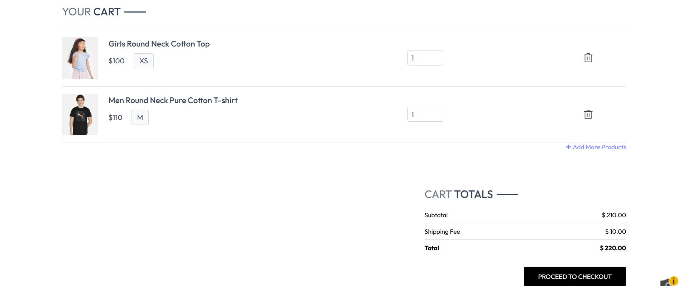
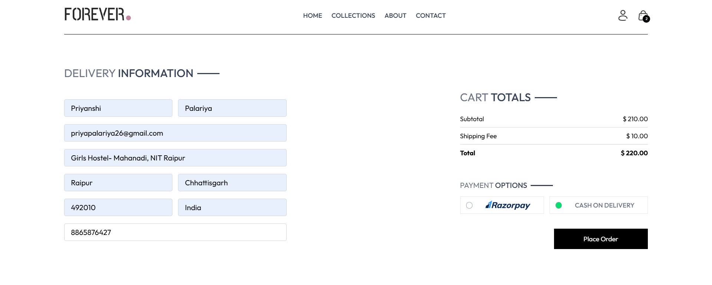
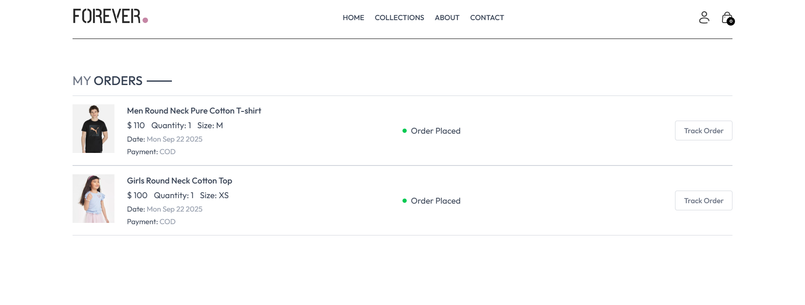

# Forever - Full-Stack E-Commerce Platform

Check out my project here 🚀 -https://vercel.com/bhavnas-projects-2e67d94c/forever-full-stack
## 📖 Table of Contents

- [About the Project](#-about-the-project)
- [✨ Key Features](#-key-features)
- [🛠️ Tech Stack](#️-tech-stack)
- [📸 Screenshots](#-screenshots)

---

## 📝 About the Project

**Forever** is a complete, full-stack e-commerce web application built from the ground up. It serves as a practical demonstration of modern web development skills, encompassing everything from the user-facing storefront to the backend server logic and database management. The platform provides a seamless and intuitive shopping experience for users and a robust administrative system for managing products, orders, and users.

This project was built to showcase proficiency in the MERN stack (MongoDB, Express.js, React, Node.js) and related technologies.

---

## ✨ Key Features

* **User Authentication**: Secure user registration and login system using JSON Web Tokens (JWT).
* **Product Catalog**: Dynamic product listings with search and filtering capabilities.
* **Shopping Cart**: Fully functional cart to add, remove, and update product quantities.
* **Order Management**: System for users to place orders and view their order history.
* **Admin Dashboard**: A  feature for administrators to manage products, users, and user's orders.
* **Responsive Design**: A mobile-first approach ensuring the application looks great on all devices.

---

## 🛠️ Tech Stack

This project is built using the MERN stack and other modern technologies:

* **Frontend**: React.js
* **Backend**: Node.js, Express.js
* **Database**: MongoDB
* **Authentication**: JSON Web Token (JWT)
* **Styling**: Tailwind CSS 

---

## 📸 Screenshots

Here's a gallery of the key features and pages within the "Forever" application.

| Homepage | Collections Page | Product Page |
| :---: | :---: | :---: |
|  |  |  |
| **Bestsellers** | **Shopping Cart** | **Checkout** |
|  |  |  |
| **Order Page** | **About Us Page** | |
|  |  | |
